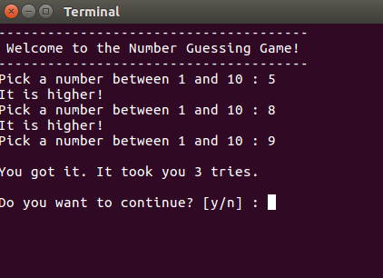

# Number Guessing Game
Python Web Development Techdegree Project 1 - Number Guessing Game

## Description
Have you ever played a game with your friends where you ask them to Pick a number between some range of numbers like: "Pick a number between 1 and 10". Their job is to make a guess, and you tell them whether their guess is too high or too low. Their next guess is based on what you've told them. If they guess the right answer the game is done. Normally you try to do this in the lowest number of tries possible. Often it is used to compete with friends to see who can get the answer in the lowest number of guesses.

## Instructions:

run `python guessing_game.py`

Note: you should have Python 3.x installed in your computer.
